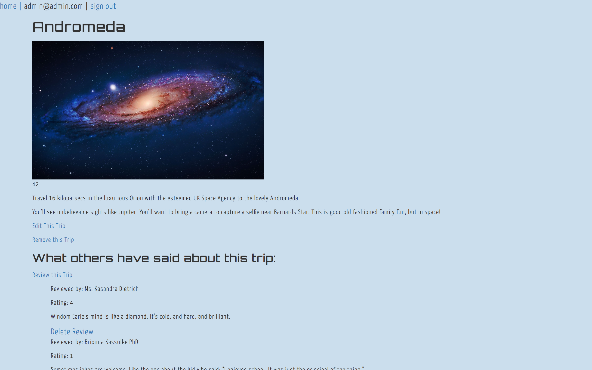

# Space Trips

This website allows the owner of Space Trips to add, update, and delete trip packages to space. Visitors are able to view all available trips and view an individual trips' detail page. Users are able to sign up for an account which allows them to leave reviews and ratings for trips they have been on.

## Prerequisites

Ruby v. 2.4.1
Web browser with ES6 compatibility
Examples: Chrome, Safari

## Built With

* ActiveRecord
* Bootstrap
* CSS - SASS
* HTML
* Postgres
* Ruby
* Rails
* Faker

## Setup/Installation Requirements

1. ⌘Command T to open a new tab in the terminal and start postgres (leave it running in the background)
```
$ postgres
```
2. Clone this repository in the terminal
```
$ git clone https://github.com/callmedw/space-trips.git
```
3. Make sure you have faker installed
```
$ gem install faker
```
4. Navigate to the project directory
```
$ cd Desktop/space-trips
```
5. In the terminal
```
$ bundle install
```
6. Open the project in a text editor of your choice
```
$ atom .
```
7. Prepare the database
```
$ rails db:reset
```
8. Start the server
```
$ rails s
```
9. Navigate to localhost:3000 in a web browser of your choice

10. Log in with these admin credentials:
email: admin@admin.com
password: administrator

## Known Bugs
*

## Authors

Dana Weiss

## License

*open source GPL & MIT*

```
Copyright (c) 2017 **Dana Weiss**
```
